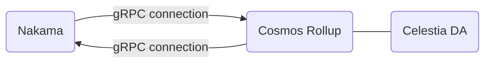

## Components

The World Engine comprises of two main components:

*   ECS Game Backend

    *   A server that handles real time game logic

*   Cosmos Rollkit Rollup

    *   A rollup blockchain that handles assets, EVM scripting, accounts, etc.

These components communicate over a secure gRPC channel to share data and execute transactions. For example, the ECS server could have logic that when a player destroys a game object, a transaction is sent to the rollup to delete that asset from the chain.

## Running the Stack (Docker)

The World Engine comes with a few preconfigured `Dockerfile`s to quickly get the entire system running in Docker. There are three `Dockerfiles` needed to run the system:

*   `📄 fixtures/celestia-client/celestia.Dockerfile` - the DA layer

*   `📄 chain/rollup.Dockerfile` - the rollup

*   `📄 game/nakama/Dockerfile` - the preconfigured ECS Server

All components can be ran with a simple script inside the `📄 chain/Makefile`.

Enter the following command in the `📄 chain` directory to start the services:

```
make start-services
```

⚠️NOTE⚠️ You will see some errors in the rollup container while the Celestia DA node boots up. This will occur for a few seconds until the rollup connects to the DA layer.

<br/>

<br/>

`📄 chain/Makefile` command that runs all required services in a single docker container.
<!-- NOTE-swimm-snippet: the lines below link your snippet to Swimm -->
### 📄 chain/Makefile
```
330    start-services:
331    	@echo "Starting services"
332    	$(shell ../game/nakama/setup.sh)
333    	@docker-compose down -v --remove-orphans
334    	@docker-compose build
335    	@docker-compose up --abort-on-container-exit --exit-code-from postgres nakama celestia node
```

<br/>

## Interacting with the Services

Interacting with the rollup is easiest via gRPC. The `📄 chain/rollup.Dockerfile` exposes the gRPC port to the localhost on port `9090`. The simplest way to interact with the rollup is by building the binary and using the World Engine CLI. This makes it easy to query the blockchain and send transactions. The rollup binary can be built from the following command in the `📄 chain/Makefile`:

<br/>

<br/>

Simply enter `make` `build`<swm-token data-swm-token=":chain/Makefile:142:0:0:`build: BUILD_ARGS=-o $(BUILDDIR)/`"/> from the root of the project. This will create a binary in the `build` directory called `argusd`.
<!-- NOTE-swimm-snippet: the lines below link your snippet to Swimm -->
### 📄 chain/Makefile
```
142    build: BUILD_ARGS=-o $(BUILDDIR)/
```

<br/>

Interacting with the preconfigured Nakama ECS Game server can be done either over gRPC or using the web interface. Follow the instructions below to access the web interface:

<br/>

<br/>

Instructions to access the Nakama Web Interface.
<!-- NOTE-swimm-snippet: the lines below link your snippet to Swimm -->
### 📄 game/nakama/readme.md
```markdown
1      go to localhost:7351 after container finishes initialization
2      
3      enter in credentials:
4      
5      username: admin
6      password: password
7      ref: https://youtu.be/Ru3RZ6LkJEk
```

<br/>

The Nakama server can also be interacted with via Nakama client libraries. See the following example below on how to interact with Nakama via the C# client library. The code below shows how to establish a connection, as well as call a custom RPC endpoint.

```csharp
public class NakamaConn : MonoBehaviour
{

    private string scheme = "http";
    private string host = "localhost";
    private int port = 7350;
    private string serverKey = "defaultkey";

    private IClient client;
    private ISession sesh;

    private ISocket sock;

    // Start is called before the first frame update
    async void Start()
    {
        // Establish Connection
        client = new Client(scheme, host, port, serverKey, UnityWebRequestAdapter.Instance);
        sesh = await client.AuthenticateDeviceAsync(SystemInfo.deviceUniqueIdentifier);
        sock = client.NewSocket();
        await sock.ConnectAsync(sesh, true);

        // Call custom RPC endpoint
        var res = await sock.RpcAsync("mint-coins");
        Debug.Log(res);
    }
}
```

## Architecture Diagram

<br/>

<!--MERMAID {width:100}-->

<!--MCONTENT {content: "flowchart LR<br/>\n2(\"Cosmos Rollup\") --- 3(\"Celestia DA\")<br/>\n1(\"Nakama\") -\\-\\-\\> |\"gRPC connection\"|2(\"Cosmos Rollup\")<br/>\n2(\"Cosmos Rollup\") -\\-\\-\\> |\"gRPC connection\"|1(\"Nakama\")"} --->

<br/>

<br/>

<br/>

This file was generated by Swimm. [Click here to view it in the app](/repos/Z2l0aHViJTNBJTNBd29ybGQtZW5naW5lJTNBJTNBQXJndXMtTGFicw==/docs/pxtvf).
