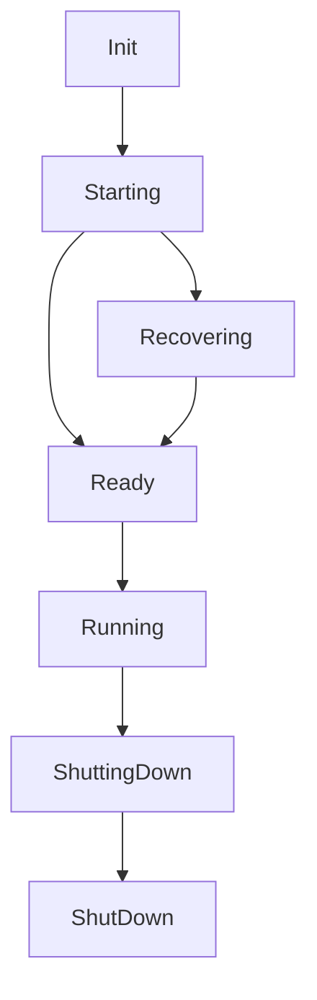

# World Stages

Cardinal worlds progress through several stages during their lifecycle, managed by the `worldstage.Manager`. Understanding these stages is crucial for proper game world management and development.

## Stage Overview

```go
const (
    Init         Stage = "Init"         // Default stage
    Starting     Stage = "Starting"     // After StartGame()
    Recovering   Stage = "Recovering"   // During chain recovery
    Ready        Stage = "Ready"        // Ready to start ticking
    Running      Stage = "Running"      // Active game state
    ShuttingDown Stage = "ShuttingDown" // Graceful shutdown
    ShutDown     Stage = "ShutDown"     // Final state
)
```

### Stage Descriptions

1. **Init**
   - Initial state of a newly created world
   - Systems and components can be registered
   - No game logic execution occurs

2. **Starting**
   - Entered after calling `StartGame()`
   - Initializes game systems
   - Prepares world for execution

3. **Recovering**
   - Active during chain state recovery
   - Rebuilds world state from blockchain
   - Ensures consistency with chain data

4. **Ready**
   - World is prepared to begin ticking
   - All systems are initialized
   - Waiting for first tick


5. **Running**
   - Active game execution state
   - Systems process game logic
   - Messages are being handled

6. **ShuttingDown**
   - Graceful shutdown in progress
   - Systems complete final operations
   - New operations are rejected

7. **ShutDown**
   - Final state after shutdown
   - No further operations possible
   - Resources are released

## Stage Management

The `worldstage.Manager` provides thread-safe stage management:

```go
type Manager struct {
    // Internal implementation
}

// Create a new manager
manager := worldstage.NewManager()

// Get current stage
currentStage := manager.Current()

// Transition stages safely
success := manager.CompareAndSwap(oldStage, newStage)

// Wait for a specific stage
<-manager.NotifyOnStage(desiredStage)
```

## Stage Transitions



### Transition Rules

1. **Forward-Only**
   - Stages generally progress forward
   - No backward transitions
   - Skip stages when appropriate

2. **Thread-Safe**
   - Uses atomic operations
   - Prevents race conditions
   - Ensures consistent state

3. **Observable**
   - Transitions emit notifications
   - Systems can wait for stages
   - Logging of all transitions

## Best Practices

1. **Initialization**
   - Register all components during Init
   - Set up systems before Starting
   - Validate configuration early

2. **Runtime Management**
   - Monitor stage transitions
   - Handle shutdown gracefully
   - Use stage notifications

3. **Error Handling**
   - Check stage before operations
   - Handle transition failures
   - Log stage changes

4. **Recovery**
   - Plan for chain recovery
   - Test recovery scenarios
   - Handle incomplete states

## Common Pitfalls

1. **Incorrect Stage Assumptions**
   - Always check current stage
   - Don't assume linear progression
   - Handle all possible stages

2. **Race Conditions**
   - Use CompareAndSwap for transitions
   - Wait for stage notifications
   - Avoid direct stage manipulation

3. **Resource Management**
   - Clean up during ShuttingDown
   - Don't start new operations while shutting down
   - Release resources properly

## Stage-Specific Behaviors

### Init Stage
```go
// Registration is allowed
world.RegisterComponent[MyComponent]()
world.RegisterSystem(mySystem)
```

### Running Stage
```go
// Game logic execution
world.Tick()
world.ProcessMessages()
```

### ShuttingDown Stage
```go
// Cleanup operations
world.CleanupResources()
world.WaitForPendingOperations()
```

## Related Documentation
- [World Context](/cardinal/game/world)
- [System Lifecycle](/cardinal/game/system)
- [Component Management](/cardinal/game/component)
